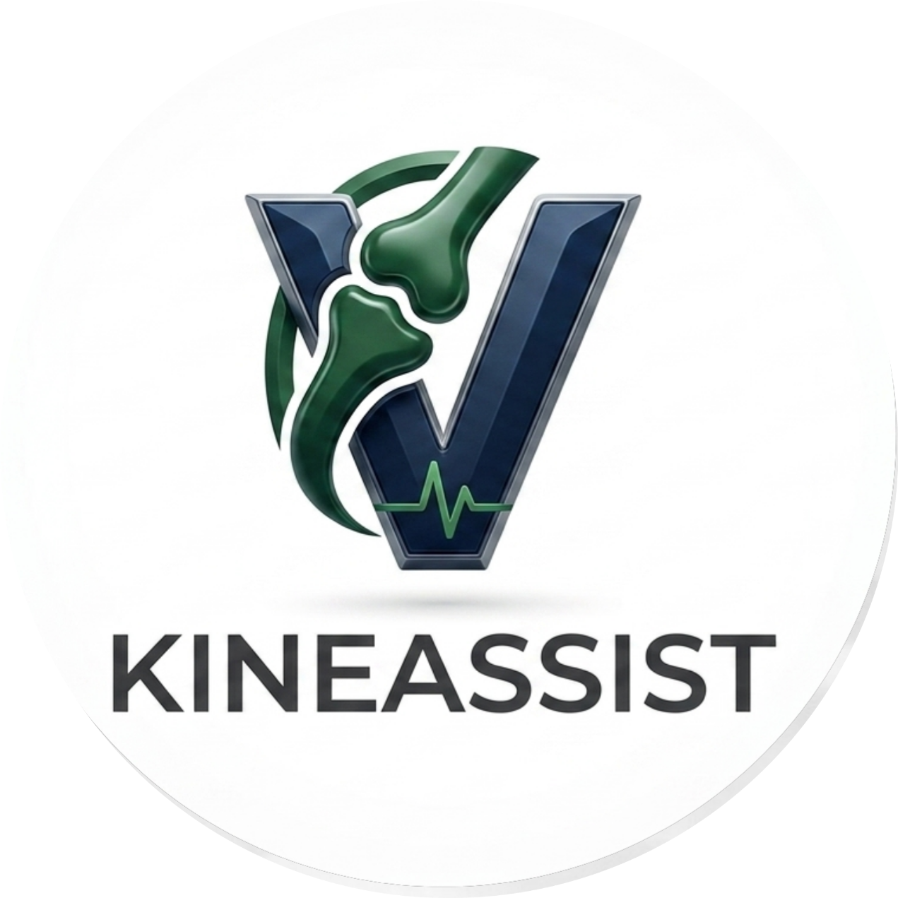

Bienvenue dans la Documentation KineAssist
=========================================

.. raw:: html

   

   
<strong>Plateforme Web de Kinésithérapie Assistée par Intelligence Artificielle</strong>

   
<em>Suivi des exercices de rééducation en temps réel — double interface kiné & patient,
   détection de mouvement par webcam, retour vocal et suivi de progression hebdomadaire.</em>

   

     
     
     
     
     
     
     
   

   

----

Accéder à l'Application
-----------------------

L'application est déployée sur **Streamlit Community Cloud** et accessible directement depuis votre navigateur, sans  aucune installation requise.

.. raw:: html

   

     <a href="https://intissarlayad.github.io/kineassist/" target="_blank"
        style="display: inline-block; background-color: #FF4B4B; color: white; padding: 12px 28px;
               border-radius: 8px; font-size: 16px; font-weight: bold; text-decoration: none;
               font-family: sans-serif; letter-spacing: 0.5px;">
       🚀 &nbsp; Ouvrir KineAssist
     </a>
   

.. list-table::
   :widths: 30 70
   :header-rows: 1

   * - Champ
     - Valeur
   * - 🌐 **URL de l'application**
     - `https://intissarlayad.github.io/kineassist/ <https://intissarlayad.github.io/kineassist/>`_
   * - ☁️ **Plateforme de déploiement**
     - Streamlit Community Cloud
   * - 📡 **Statut**
     - ✅ Déployée et accessible en ligne
   * - 🖥️ **Compatibilité**
     - Chrome, Firefox, Edge (navigateur moderne requis)
   * - 📷 **Prérequis matériel**
     - Webcam fonctionnelle pour la détection de mouvement

----

À propos
--------

**KineAssist** est une application web à double interface dédiée au suivi de la rééducation
kinésithérapique à distance. Elle permet à un kinésithérapeute de créer des protocoles
d'exercices personnalisés pour ses patients, et au patient d'exécuter ces exercices de manière
autonome depuis chez lui, guidé par un système de détection de mouvement en temps réel.

L'application repose sur **MediaPipe Pose**, une bibliothèque de Google permettant l'estimation
de la posture humaine via webcam. Chaque exercice est évalué automatiquement : le système analyse
la qualité du mouvement, compte les répétitions et attribue un score, sans intervention humaine directe.

La plateforme propose un environnement bidirectionnel :

* 👩‍⚕️ **Côté Kinésithérapeute** : Création de profils patients, prescription de protocoles
  d'exercices personnalisés et suivi graphique détaillé de la progression clinique.
* 🧘 **Côté Patient** : Exécution d'exercices guidés par webcam avec rétroaction visuelle et
  vocale immédiate, correction posturale automatisée et comptage précis des répétitions.

Grâce à l'intégration locale de **MediaPipe Pose** et d'un moteur de recherche sémantique
(**RAG local**), le système fournit des conseils d'ajustements biomécaniques issus des directives
officielles de la Haute Autorité de Santé (HAS), sans nécessiter d'API tierces ni compromettre
la confidentialité des données de santé.

----

.. toctree::
   :maxdepth: 2
   :caption: 📚 Documentation Complète

   projet
   installation
   screenshots
   interface
   architecture
   database
   rag
   analyse

----

Liens Rapides
-------------

.. list-table::
   :widths: 40 60
   :header-rows: 1

   * - Ressource
     - Lien
   * - 🚀 **Application en ligne**
     - `KineAssist — Live <https://intissarlayad.github.io/kineassist/>`_
   * - 📦 Code Source
     - `GitHub Repository <https://github.com/ayaidh123/Kineassist>`_
   * - 🖥️ Application Clinique (local)
     - `Streamlit App locale <http://localhost:8501>`_

----

Auteures
--------

Ce projet a été développé par deux étudiantes en intelligence artificielle dans le cadre d'un projet académique.

.. list-table::
   :widths: 20 40 40
   :header-rows: 1

   * - Auteure
     - GitHub
     - LinkedIn
   * - **Aya IDHAMOUCH** — *AI Engineer*
     - `@ayaidh123 <https://github.com/ayaidh123>`_
     - `aya-idhamouch <https://www.linkedin.com/in/aya-idhamouch-22a996319>`_
   * - **Intissar LAYAD** — *AI Engineer*
     - `@intissarlayad <https://github.com/intissarlayad>`_
     - `intissar-layad <https://www.linkedin.com/in/intissar-layad-07444b377>`_

----

*© 2026 Aya IDHAMOUCH & Intissar LAYAD — Projet Académique Distribué sous Licence Libre.*