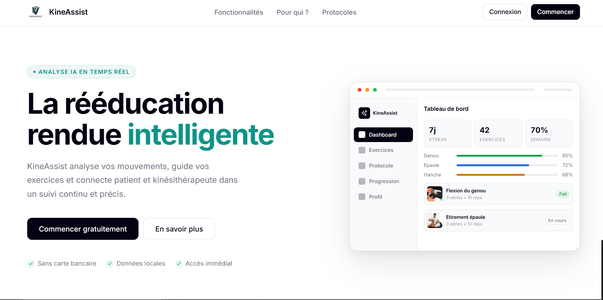
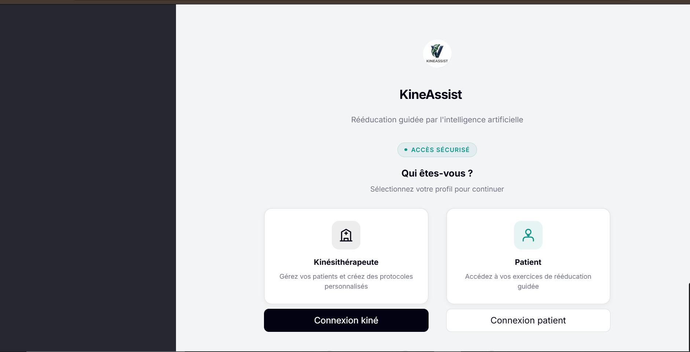
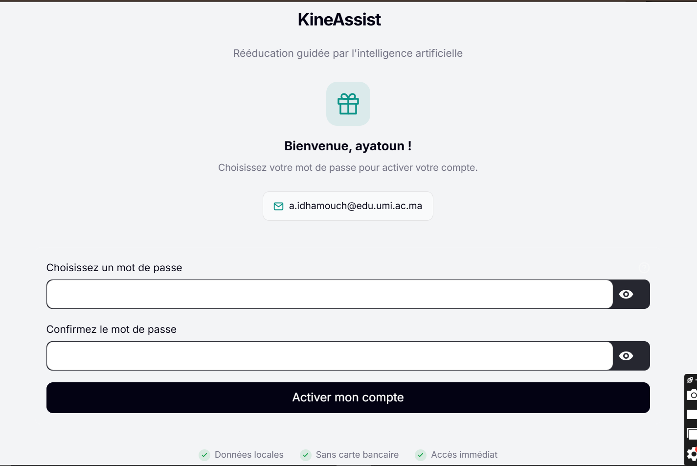
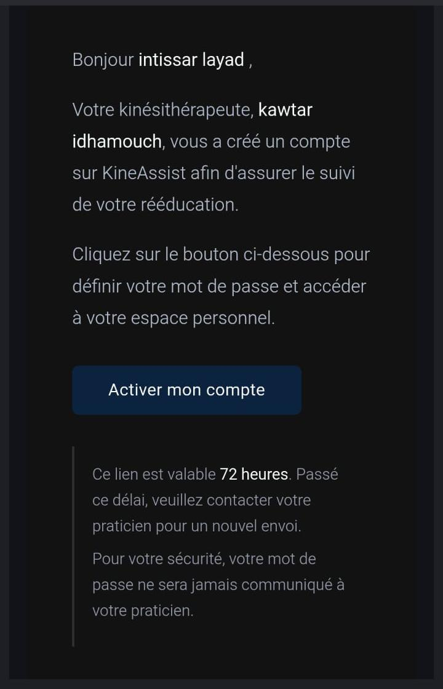
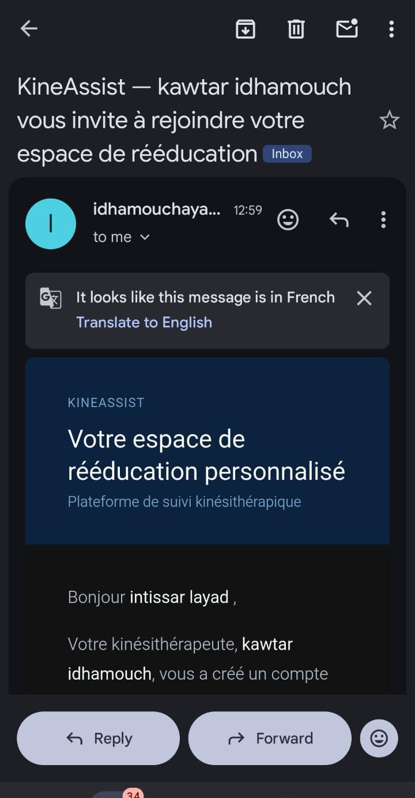
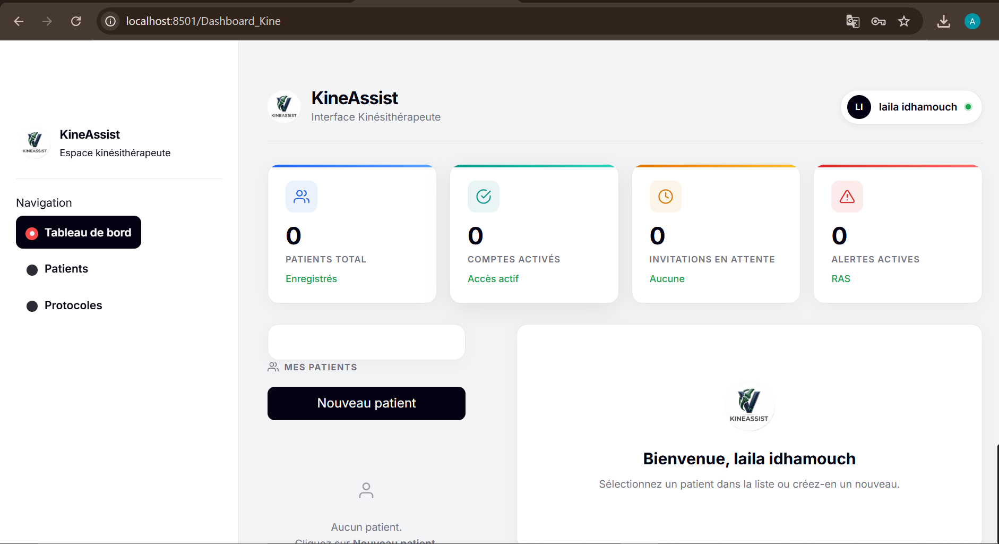
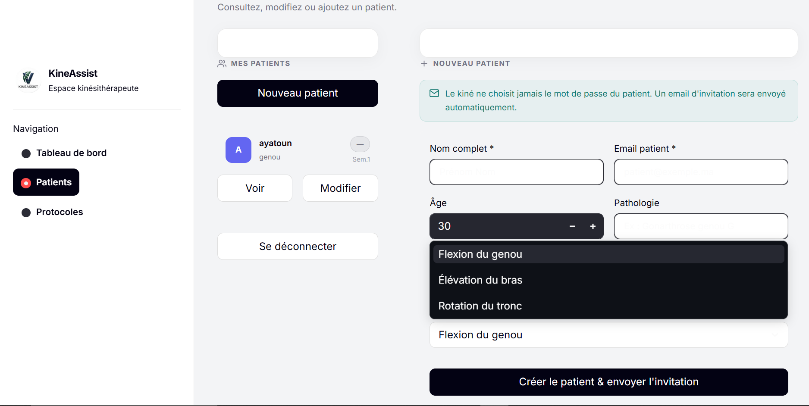
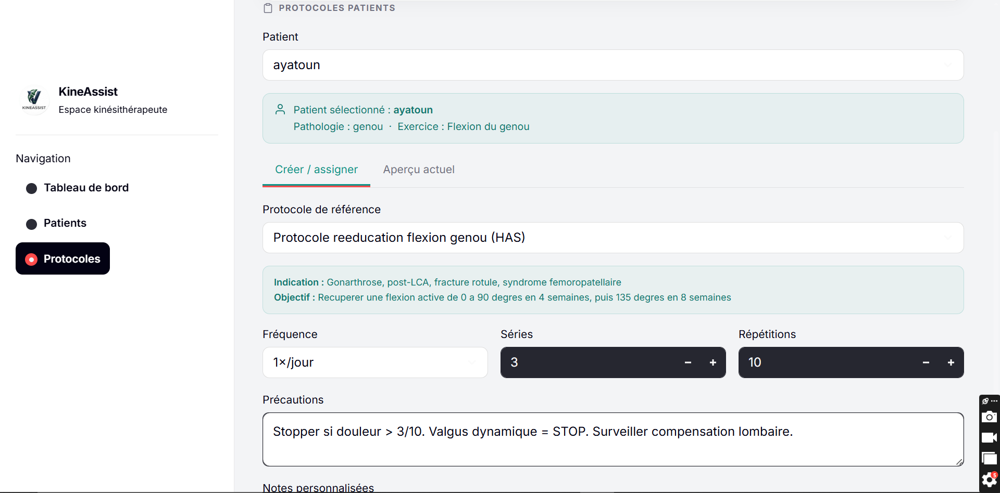
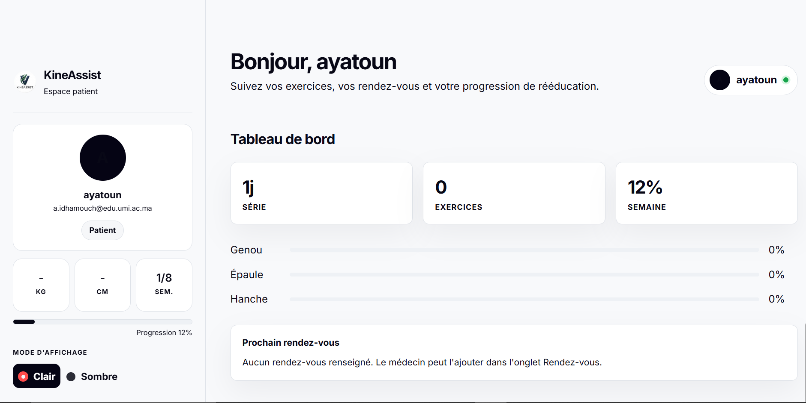
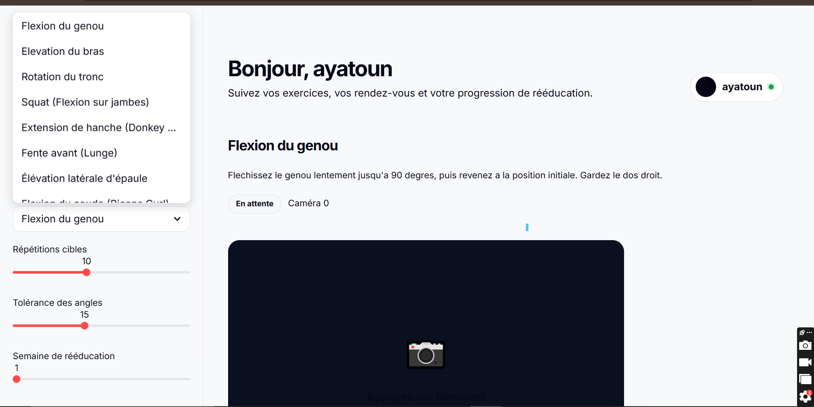

Screenshots
===========

Voici un aperçu des différentes interfaces de KineAssist.

Landing Page
------------

Page d'accueil publique présentant la plateforme KineAssist.

Authentification
----------------

Interface de connexion commune aux kinésithérapeutes et aux patients.

Activation du compte patient
-----------------------------

Le patient active son compte via le lien reçu par email.

Email d'invitation
------------------

Email reçu par le patient contenant le lien d'activation sécurisé.

Interface Kinésithérapeute
--------------------------

Tableau de bord principal du kinésithérapeute avec la liste des patients.

Création d'un dossier patient
------------------------------

Formulaire de création d'un nouveau dossier patient (pathologie, objectifs, semaine de rééducation).

Assignation d'un protocole d'exercices
---------------------------------------

Interface d'assignation d'un protocole d'exercices personnalisé au patient.

Dashboard Patient
-----------------

Tableau de bord du patient avec les exercices prescrits et la progression hebdomadaire.

